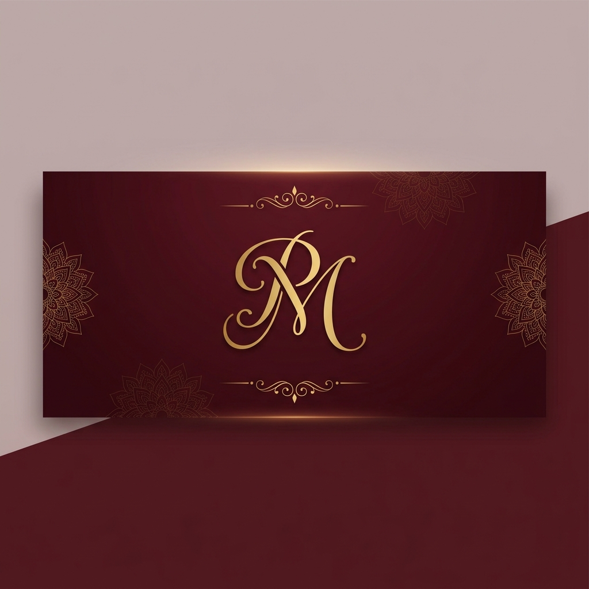

<div align="center">
  
  
  <h1>Priya & Melvin — Wedding Invitation</h1>
  
  <p>
    A premium, digital wedding invitation experience showcasing high-end frontend craftsmanship, custom Odia typography support, and modern aesthetic design.
  </p>
</div>

---

## 🌟 Live Demo

**Experience the live invitation here:**  
👉 **[priyamelvinodia.pages.dev](https://priyamelvinodia.pages.dev)**

---

## ✨ Features

- **Elegant Single-Page Experience:** Seamlessly designed to provide a luxurious and cohesive user journey.
- **Responsive Design:** Fluid layout that adapts perfectly across desktop, tablet, and mobile devices.
- **Odia Typography Support:** Custom integration of Noto Serif Oriya to flawlessly render Odia characters without breaking the primary Latin aesthetic.
- **Premium Visual Design:** A cinematic, rich maroon and soft gold color scheme inspired by traditional Indian weddings.
- **Smooth Scrolling & Modern Animations:** Delightful micro-interactions, reveal animations, and a polished scroll experience.
- **Wedding Timeline & Events:** Beautifully structured itinerary for sacred ceremonies and reception.
- **Live Countdown:** An elegant, real-time countdown to the wedding date.
- **Optimized Favicon Setup:** Multi-size P&M monogram favicon for perfect browser and mobile bookmark representation.
- **Fast Loading & Lightweight:** Pure HTML/CSS/JS without heavy frameworks, ensuring a high-performance experience.

---

## 🛠️ Tech Stack

| Technology | Description |
| :--- | :--- |
| **HTML5** | Semantic, accessible markup |
| **CSS3** | Custom properties, modern layout, and keyframe animations |
| **Vanilla JavaScript** | Lightweight interactivity and countdown logic |
| **Google Fonts** | `Cormorant Garamond`, `Jost`, `Great Vibes`, and `Noto Serif Oriya` |
| **GitHub** | Version control and repository hosting |
| **Cloudflare Pages** | Fast, edge-network static deployment |

---

## 🎨 Color Palette

The project utilizes a carefully curated luxury palette defined by CSS variables:

- **Deep Maroon (`#5c1520`)** – The rich, cinematic background color representing tradition.
- **Soft Gold (`#c9a96e`)** – Used for elegant decorative elements and accents.
- **Ivory & Champagne (`#faf6ef`, `#f5ece0`)** – Warm, inviting neutral tones for the base canvas.
- **Text Tones** – Varied contrasts from `text-dark` to `text-muted` for optimal typography hierarchy.

---

## 📂 Folder Structure

```text
priyamelvin-odia-invitation/
├── assets/
│   ├── images/
│   │   └── favicon-source.png
│   └── readme-banner.png       # GitHub repository banner
├── favicon-16x16.png           # Production 16px favicon
├── favicon-32x32.png           # Production 32px favicon
├── favicon.ico                 # Multi-size legacy favicon
├── index.html                  # Main application entry point
├── LICENSE                     # Repository license
└── README.md                   # Project documentation
```

---

## 💻 Local Development

To run this project locally, simply clone the repository and serve the static files:

1. **Clone the repository**
   ```bash
   git clone https://github.com/Rashmiranjantandia/priyamelvin-odia-invitation.git
   cd priyamelvin-odia-invitation
   ```

2. **Serve the project**
   Using `npx` (requires Node.js):
   ```bash
   npx serve .
   ```
   *Alternatively, you can use Python:*
   ```bash
   python -m http.server 8000
   ```

3. **View the site**
   Open `http://localhost:3000` (or the port specified by your server) in your browser.

---

## 🚀 Deployment

This static site is optimized for modern edge hosting and is deployed globally via **Cloudflare Pages**. Since it consists entirely of static assets, it can be hosted seamlessly on any static platform (Vercel, Netlify, GitHub Pages, etc.) without a build step.

---

## ⚡ Performance

Built as a lightweight static web page, the project eliminates the overhead of large JavaScript frameworks. It relies on vanilla web standards, optimized CSS, and minimal DOM manipulation to achieve near-instant load times and buttery smooth scrolling performance.

---

## 📖 About the Project

This project was built to deliver a premium digital wedding invitation for Priya and Melvin. The goal was to combine the richness of traditional aesthetics with modern frontend development techniques. A key achievement of this project is the flawless integration of **Odia (Oriya)** text alongside elegant English typography, ensuring cultural authenticity without compromising on luxury design.

---

## 👨‍💻 Developer

Developed with ❤️ by **[Rashmi Ranjan](https://github.com/Rashmiranjantandia)**.

---

<div align="center">
  <em>Thoughtfully crafted for a beautiful beginning.</em>
</div>
